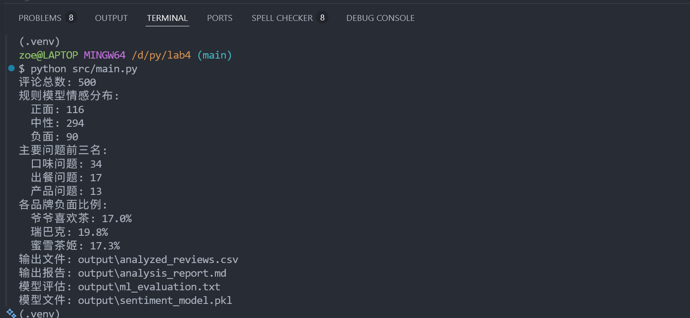
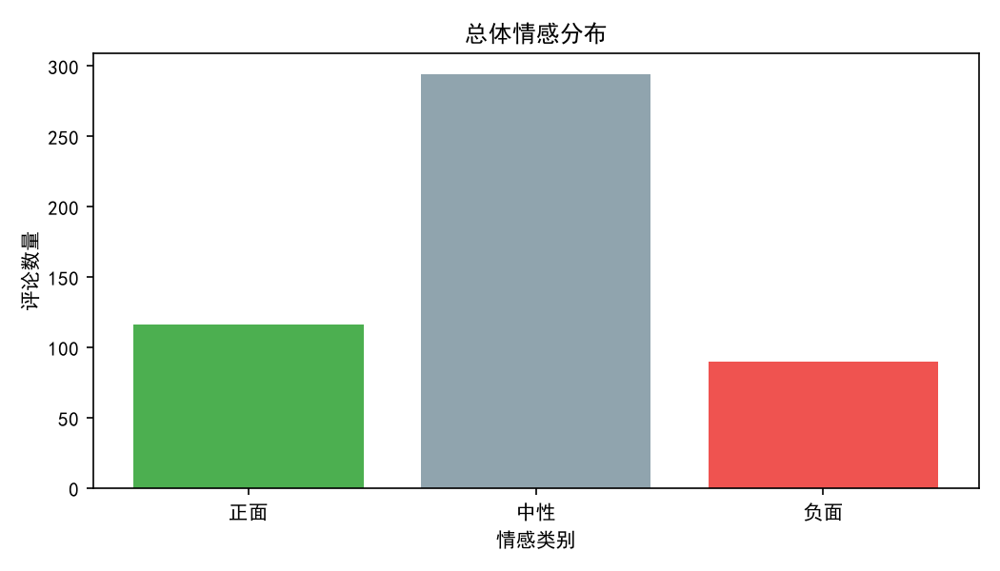
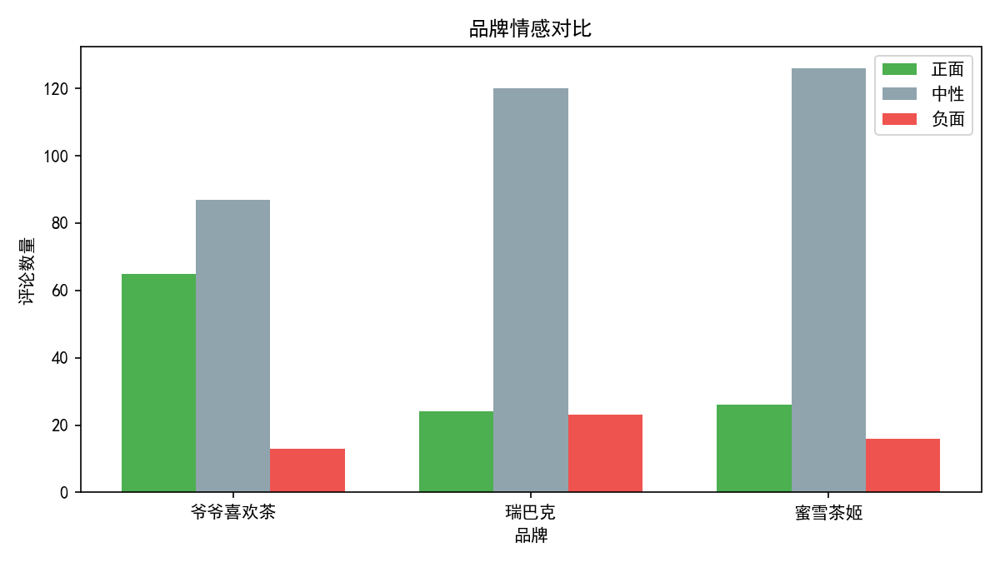
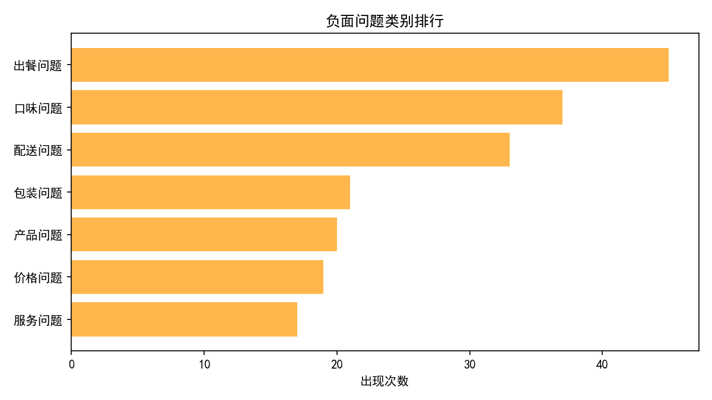
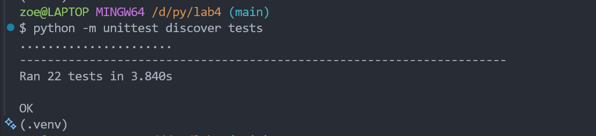

# 《软件开发技术基础》实验报告

实验名称：奶茶店评论情感分析与服务改进建议系统
学号：_____________    姓名：_____________

## 一、实验内容

本次实验完成了一个面向奶茶店消费评论的文本分析系统。系统以 `data/reviews.csv` 中的评论数据为输入，对评论进行读取、清洗、情感分析、问题归因、品牌对比统计，并将分析结果导出为 CSV、Markdown 报告和 PNG 图表。

项目选择奶茶店评论作为应用场景，主要是因为这类评论通常比较短，但包含了口味、价格、出餐速度、服务、包装、配送、小料等比较明确的用户反馈。直接人工逐条查看评论效率较低，所以我把实验目标定为：用程序自动汇总评论情感倾向，找出差评中出现较多的问题，并根据统计结果生成改进建议。

系统主要实现了以下功能：

1. 读取 CSV 评论数据，并校验字段、评分和情感标签是否有效。
2. 对评论文本进行标点清理、停用词过滤和关键词提取。
3. 使用情感词典、程度副词和否定词实现规则情感分析。
4. 使用 `TF-IDF + LogisticRegression` 训练一个简单的监督学习情感分类器。
5. 将用户评分映射为情感标签，并与人工标签、规则模型结果、机器学习结果进行一致率对比。
6. 对非正面评论进行问题归因，识别口味、价格、出餐、服务、包装、配送、产品等问题。
7. 统计整体情感分布、各品牌情感情况、高频关键词和问题排行。
8. 生成分析报告、逐条分析结果表、模型评估文件和三张统计图。

从代码结构上看，系统按功能拆分为多个类，例如 `ReviewReader` 负责数据读取，`TextCleaner` 负责文本处理，`SentimentAnalyzer` 负责规则情感分析，`ProblemAnalyzer` 负责问题归因，`StatisticsManager` 负责统计，`ReportExporter` 和 `ChartGenerator` 负责结果输出。这样拆分后，每个模块的职责比较清楚，也方便后面写单元测试。

## 二、实验环境

本次实验使用的环境如下：

| 项目 | 内容 |
|---|---|
| 操作系统 | Windows 11 |
| Python 版本 | Python 3.12.3 |
| 开发工具 | Visual Studio Code、PowerShell |
| 版本管理 | Git |
| 主要第三方库 | scikit-learn、matplotlib、joblib |
| 测试工具 | Python unittest |

项目依赖写在 `requirements.txt` 中，运行前可通过下面命令安装：

```bash
pip install -r requirements.txt
```

主程序运行命令为：

```bash
python -m src.main
```

单元测试运行命令为：

```bash
python -m unittest discover tests
```

## 三、实验过程

### 1. 数据准备与读取

实验数据保存在 `data/reviews.csv` 中，共 500 条评论。数据字段包括评论编号、日期、品牌、产品、渠道、评论内容、评分和人工情感标签。数据来源由两部分组成：一部分来自 ASAP 公开中文餐馆评论 sample 中经过饮品场景过滤后保留的奶茶/饮品相关评论片段（约 32 条）；另一部分是人工整理的奶茶消费场景样例（约 468 条），用来覆盖甜度、冰量、小料、外卖包装等更贴近本项目的问题。 ASAP 原始数据覆盖烧烤、火锅、海鲜、日料等多种餐饮场景，因此通过白名单/黑名单过滤后仅保留与奶茶、果茶、咖啡、饮料相关的句子，避免无关餐厅评论进入分析。由于当前数据主要服务于课程项目展示，后续统计结果适合用于说明系统功能和分析流程，不直接作为真实商业判断依据。

输入数据中保留 `rating` 和 `label` 主要是为了训练和验证。`label` 作为监督学习标签，用于训练和评估机器学习模型；`rating` 作为辅助参考字段，用来映射出一个评分情感标签。系统最终分析不直接使用 `rating` 判断情感，而是结合评论文本内容进行规则分析和机器学习预测，再将程序生成的结果与 `label`、评分映射结果进行对比。

读取数据时，我没有直接使用字典在各模块之间传来传去，而是定义了 `Review` 数据类保存单条评论及后续分析结果。这样后面不管是补充 tokens、情感得分，还是记录问题类别，都能放到同一个对象中，代码也更容易检查。

核心数据对象如下：

对应代码如下（来自 `src/models.py`）：

```python
@dataclass
class Review:
    review_id: str
    date: str
    brand: str
    product: str
    channel: str
    content: str
    rating: int
    label: str
    tokens: list[str] = field(default_factory=list)
    rating_sentiment_label: str = ""
    rule_sentiment_score: float = 0.0
    rule_sentiment_label: str = ""
    ml_sentiment_label: str = ""
    problem_categories: list[str] = field(default_factory=list)
```

数据读取模块会检查 CSV 是否包含必要字段，评分是否在 1 到 5 之间，标签是否属于“正面、中性、负面”，评论正文是否为空。这样可以避免脏数据进入后续分析流程。

### 2. 文本清洗与关键词提取

文本清洗主要由 `TextCleaner` 完成，处理步骤包括去除常见标点、合并空格、匹配词典短语、过滤停用词等。评论中有些品牌名或产品名可能会干扰情感判断，例如品牌“爷爷喜欢茶”中包含“喜欢”，如果不处理，程序可能会把本来中性的评论误判为正面。

为了解决这个问题，系统在处理单条评论时，会把当前评论的品牌名和产品名作为忽略项，只分析真正的评论正文表达。这个问题在调试时比较容易被忽略，后面我专门加了回归测试，确认品牌名里的情感词不会进入评分 tokens。

### 3. 规则情感分析

规则情感分析使用情感词、否定词和程度副词。基本思路是遍历评论提取出的 tokens，如果遇到情感词，就取它的基础分；如果前一个词是程度副词，就乘以权重；如果前一个词或前两个词是否定词，就把分数取反。

核心逻辑如下：

对应代码如下（来自 `src/sentiment_analyzer.py`）：

```python
def calculate_score(self, tokens: list[str]) -> float:
    score = 0.0
    for index, token in enumerate(tokens):
        base = self.lexicon.get_base_score(token)
        if base == 0:
            continue
        weight = 1.0
        reversed_score = False
        if index > 0:
            previous = tokens[index - 1]
            weight = self.lexicon.get_degree_weight(previous)
            reversed_score = self.lexicon.is_negation(previous)
        if index > 1 and self.lexicon.is_negation(tokens[index - 2]):
            reversed_score = True
        current = base * weight
        if reversed_score:
            current *= -1
        score += current
    return score
```

情感分类规则为：

```text
score >= 1      判为正面
-1 < score < 1  判为中性
score <= -1     判为负面
```

（阈值选择 1 和 -1 的原因是：奶茶评论通常较短，单条评论中往往只有一个明确的情感词。若正面阈值设得过高，像“好喝”“细腻”“稳定”这类短评价容易被误判为中性；而将正面阈值设为 1，负面阈值保持 -1，可以在保证可解释性的同时，让规则模型对常见短评论更敏感，减少中性区间的漏判。）

规则方法的优点是过程比较直观，能够说明一条评论为什么被判成正面或负面；缺点是词典覆盖不够时会漏判，所以后面又增加了机器学习分类器作对比。

### 4. 机器学习情感分类

机器学习部分使用 `scikit-learn` 实现，模型组合为 `TfidfVectorizer + LogisticRegression`。由于中文短评论不一定适合依赖分词库，本实验采用字符级 n-gram 特征：

```python
self.model = Pipeline(
    [
        ("tfidf", TfidfVectorizer(analyzer="char", ngram_range=(1, 2))),
        ("clf", LogisticRegression(max_iter=1000)),
    ]
)
```

训练和评估时，使用人工标注的 `label` 字段作为监督标签，按 8:2 划分训练集和测试集，并固定 `random_state=42`，保证多次运行结果比较稳定。

本次运行得到的模型评估结果如下：

```text
accuracy: 0.9500
precision: 0.9504
recall: 0.9500
f1-score: 0.9496

confusion matrix:
[[42, 0, 1], [3, 21, 0], [0, 1, 32]]
```

从结果看，模型在当前样例数据上的整体准确率为 95.00%。负面评论的 precision 和 recall 都比较高，说明模型对明显差评的识别效果较好；中性评论 recall 相对低一点，主要原因是中性评论和轻微正负面评论之间边界不够明显。

从混淆矩阵看，测试集中正面评论有 1 条被误判为负面，中性评论有 3 条被误判为正面，负面评论有 1 条被误判为中性。这个结果说明模型对正面和负面评论的识别较稳定，但对语气较轻、表达不明显的中性评论还存在一定混淆。

### 5. 评分标签对比、问题归因与建议生成

系统还增加了评分标签对比功能。具体映射规则为：

```text
rating >= 4      映射为正面
rating == 3      映射为中性
rating <= 2      映射为负面
```

该结果保存为 `rating_sentiment_label`，并导出到 `output/analyzed_reviews.csv`。本次运行中，三类结果与人工标签的一致率如下：

| 对比对象 | 一致率 |
|---|---:|
| 规则模型与人工标签 | 54.80% |
| 机器学习模型与人工标签 | 98.40% |
| 评分映射与人工标签 | 100.00% |

评分映射与人工标签一致率为 100.00%，是因为当前样例数据的 `label` 基本按评分区间构建，可作为一个参考基线；它不能代替文本情感分析。规则模型的一致率较低，主要因为规则模型更保守，容易把没有明显情感词的评论判为中性；机器学习模型在全量数据上的一致率较高，但它依赖已有标注数据，实际泛化能力仍需要更多外部数据验证。

问题归因只针对非正面评论进行处理。系统维护了七类问题关键词，分别是口味问题、价格问题、出餐问题、服务问题、包装问题、配送问题和产品问题。一条评论可以同时命中多个问题类别，例如“太甜了，包装还漏了，等了很久”会同时归到口味、包装和出餐问题。

归因之后，`SuggestionGenerator` 会根据每个品牌出现最多的几个问题生成改进建议。例如口味问题较多时，建议复核甜度、冰量和茶底比例；包装问题较多时，建议检查杯盖密封性和外卖二次封装。

### 6. 系统流程整合

完整流程由 `SystemController` 串联。程序先读取评论，再构建词表和清洗器，接着逐条进行规则情感分析与问题归因，然后训练机器学习模型并预测每条评论，最后生成统计结果、图表和报告。

运行后主要输出文件如下：

| 文件 | 说明 |
|---|---|
| `output/analyzed_reviews.csv` | 每条评论的评分映射标签、情感结果、问题归因和模型预测结果 |
| `output/analysis_report.md` | 综合分析报告 |
| `output/ml_evaluation.txt` | 机器学习模型评估结果 |
| `output/sentiment_model.pkl` | 持久化的 sklearn 情感分类模型 |
| `output/charts/sentiment_distribution.png` | 整体情感分布图 |
| `output/charts/brand_sentiment_compare.png` | 品牌情感对比图 |
| `output/charts/problem_ranking.png` | 主要问题排行图 |

主程序运行截图如下：



运行后生成的图表如下：







终端运行主程序时，输出结果如下：

```text
评论总数: 500
规则模型情感分布:
  正面: 116
  中性: 294
  负面: 90
主要问题前三名:
  口味问题: 34
  出餐问题: 17
  产品问题: 13
各品牌负面比例:
  爷爷喜欢茶: 17.0%
  瑞巴克: 19.8%
  蜜雪茶姬: 17.3%
输出文件: output/analyzed_reviews.csv
输出报告: output/analysis_report.md
模型评估: output/ml_evaluation.txt
模型文件: output/sentiment_model.pkl
```

单元测试结果如下：

```text
Ran 24 tests
OK
```



## 四、结果分析

从整体结果看，500 条评论中，规则模型判断为正面的有 116 条，中性的有 294 条，负面的有 90 条。中性评论占比较高，说明规则模型在没有明显情感词时比较保守，这一点符合预期。人工标注数据中正面、负面和中性都有一定数量，因此也能支持后面的机器学习训练。

本系统同时保留规则模型和机器学习模型，主要是为了兼顾可解释性和分类效果。规则模型虽然比较依赖词典，但能够解释具体命中的情感词和问题类别，适合用于生成改进建议；机器学习模型能够从标注数据中学习文本模式，整体分类指标更高，但单条预测结果不如规则模型直观。因此本实验在报告统计和问题归因中主要采用规则模型，在模型评估部分展示 sklearn 分类器效果。

从一致率对比看，评分映射与人工标签完全一致，说明当前数据的人工标签与评分区间保持一致，适合作为监督学习训练标签；但如果只根据评分得到情感，就无法发现评论正文中的具体问题，例如“太甜”“排队”“包装漏”等。因此系统仍以文本分析为核心，通过规则模型和机器学习模型从评论内容中提取情感倾向和问题类别。

问题归因结果中，出现次数最多的是口味问题，共 34 次，其次是出餐问题 17 次、产品问题 13 次。这个结果和奶茶消费场景比较一致：用户通常最在意甜度、茶味、奶盖、小料新鲜度以及等待时间。服务问题出现次数较少，说明当前样例数据中直接评价服务态度的评论不多。

品牌对比方面，三个样例品牌的负面比例分别约为 17.0%、19.8% 和 17.3%，差距不算特别大。其中“瑞巴克”的负面比例略高，主要问题集中在口味和产品体验上。由于本项目的数据量还不算大，这个结果更适合作为课程实验展示，不适合直接当作真实商业结论。

实验过程中遇到的主要问题有：

1. 品牌名干扰情感分析。
   一开始没有考虑品牌名中可能包含情感词，后来发现“爷爷喜欢茶”里的“喜欢”会影响评分。解决办法是在提取 tokens 时忽略当前评论对应的品牌名和产品名，并增加测试用例防止问题再次出现。

2. 中文短文本不好分词。
   如果使用复杂分词工具，会增加环境依赖；如果完全按单字处理，又会丢失“太甜”“等很久”“包装漏”等短语信息。最后采用词典短语匹配和字符级 TF-IDF 相结合的方式，规则模型保留可解释性，机器学习模型补充分类型能力。

3. 中性评论边界不清楚。
   部分评论只是在描述体验，没有特别明确的好坏；还有些评论语气较轻，例如“有点一般”“还可以”，规则模型和机器学习模型都可能出现分歧。后续如果继续完善，可以把中性评论拆得更细，或者增加更多人工标注样本。

本次实验让我对一个完整 Python 项目的开发流程有了更具体的理解。相比只写一个单独算法函数，这个项目还涉及数据读取、数据结构设计、模块拆分、异常处理、测试、图表和报告导出。最终系统能够从原始评论生成可读的分析结果，也能通过单元测试验证主要功能。

## 五、项目仓库

源码和运行说明已上传至 GitHub：

```text
https://github.com/brightzoe/milk-tea-review-analysis.git
```

后续如果继续改进，我会考虑增加更大的真实评论数据，并尝试把系统做成简单的 Web 页面，方便直接上传 CSV 后查看图表。
